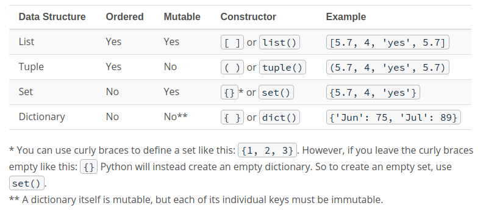

__Python Class Example__

This repo contains a Python Class which provides an example on the basic usage of private and public variables nd methods. Besides, it provides the links where further information on this ideas can be found. 

This file also provides a general example on how to use the *configparser* Python modue to read con config file and use it along the script. 

Finally, the code in this file is commented using Doxygen standards. Documentation can be easily generated by running the next commands to prepare a generic config file compile it. 

* $ doxygen -g config 
* $ doxygen config

Set EXTRACT_ALL tag to YES so that functions are documented. 
Doxygen will assume all entities in # documentation are documented, even if no documentation was available. # Private class members and static file members will be hidden unless # the EXTRACT_PRIVATE and EXTRACT_STATIC tags are set to YES EXTRACT_ALL = YES # If the EXTRACT_PRIVATE tag is set to YES all private members of a class # will be included in the documentation. 

# If the EXTRACT_ALL tag is set to YES 
For a general basic Python programming overview, here is a course (free one, as far as I know):

https://classroom.udacity.com/courses/ud1110

In order to understand the usage of Python imports, I recommend this tutorial:
https://www.devdungeon.com/content/python-import-syspath-and-pythonpath-tutorial

In order to understand the usage of Python imports, I recommend this tutorial:
https://www.geeksforgeeks.org/global-keyword-in-python/

Sum up image with basic information on different Python datatypes. 

__Pip package manager__

Pip is a package manager that has been included with the Python installer since versions 3.4 for Python 3 and 2.7.9 for Python 2. Python standard library includes an extensive set of packages and modules. At the same time, Python has a very active community that contributes. These packages are published to the Python Package Index, also known as PyPI (pronounced Pie Pea Eye).

Basic Package Installation

You can learn about pip supported commands by running it with help:
* $ pip help

Pip provides an install command to install packages. You can run it to install the requests package:
* $ pip install requests

*You use pip with an install command followed by the name of the package you want to install, pip looks for the package in PyPI, calculates its dependencies, and installs them to insure requests will work.*

The installer shows the version of the pip package in the current environment, and warns if there is a newer version available. It also shows the command you should use to update pip.
* $ python -m pip install --upgrade pip

Notice that you use python -m to update pip. The -m switch tells Python to run a module as an executable. When you run pip as a module, Python loads the module in memory and allows the package to be removed while it is being used. 

You can use the list command to see the packages installed in your environment:
* $ pip list

The pip install <package> command always looks for the latest version of the package and installs it. It also searches for dependencies listed in the package metadata and installs those dependencies to ensure that the package has all the requirements it needs.
  
If you want to install a specific version of a package that you know works with your code, you should create a specification of the dependencies and versions you used to develop and test your application, so there are no surprises when you use the application in production. To get the actual requirements of a package and write it to a file:
* $ pip freeze > requirements.txt

Requirement files allow you to specify exactly which packages and versions should be installed. The problem with hardcoding the versions of your packages and their dependencies is that packages are updated frequently with bug and security fixes, and you probably want to leverage those as soon as they are published. The requirements file format allows you to specify dependency versions using logical operators (such as >= to allow newer versions, or < to avoid them due to incompatibilities ) that give you a bit of flexibility to insure packages are updated, but still define the base versions of a package. You can upgrade the packages in your requirements file by running:
* $ pip install --upgrade -r requirements.txt

*Uninstalling Packages*

Once in a while, you will have to uninstall a package, which can be a bit tricky. Notice that, when you installed requests, pip installed other dependencies too. The more packages you install, the bigger the chances that multiple packages depend on the same dependency. Therefore, before you uninstall a package, make sure you run the show command for that package:
* $ pip show package

Notice there are two fields that show the *Requires* and *Required-by* packages. You should run the show command against all of the required dependencies to make sure that no other libraries also depend on them. Once you understand the dependency order of the packages you want to uninstall, you can remove them using the uninstall command:
* $ pip uninstall package

*Alternatives to pip - Conda*

Conda is a package, dependency, and environment manager for many languages including Python. In fact, its origin comes from Anaconda, which started as a data science package for Python. Conda is widely used for data science and machine learning applications, and uses its own index to host compatible packages. Conda not only allows you to manage package dependencies, but it also manages virtual environments for your applications, installs compatible Python distributions, and packages your application for deployment to production. Setting Up Python for Machine Learning on Windows is a great introduction to Conda that explores package and environment management. The only Windows-specific information is around installation, so it’s still relevant if you use a different OS platform

